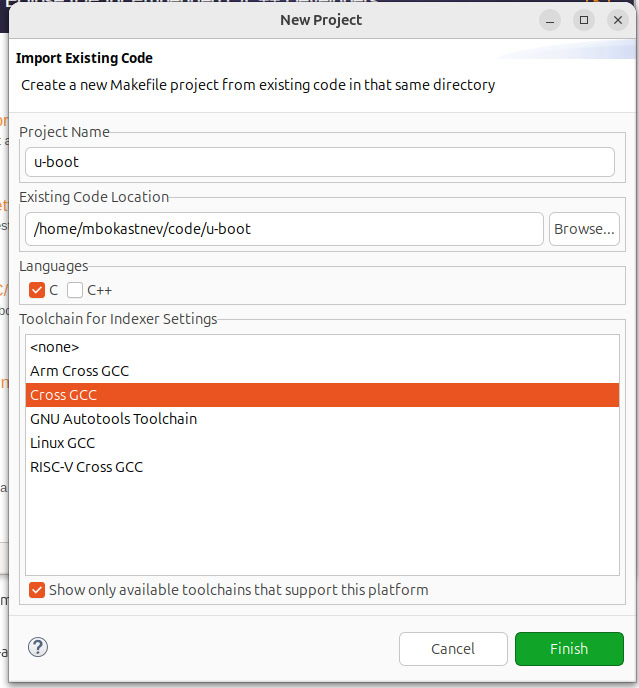

# Setup Eclipse for u-boot debug through jlik.

1. Download tar archive from [eclipse](https://www.eclipse.org/downloads/):
2. Extract **eclipse-inst-jre-linux64.tar.gz** trough nautilus popup.
3. go to Downloads/eclipse-inst-jre-linux64/eclipse-installer and run eclipse-inst.
4. select **eclipse IDE for embedded C/C++ developers**

5. install gdb-multiarch:
```
sudo apt-get install gdb-multiarch
```
6. download [JLink drivers](https://www.segger.com/downloads/jlink/).  
Version 7_88n works fine for beaglebone black. 
remove drivers with different version:
```
sudo dpkg --remove jlink
```
Download JLink_Linux_V788n_x86_64.deb and install it.
```
sudo dpkg -i JLink_Linux_V788n_x86_64.deb
```
7. clone u-boot and build u-boot
```
git clone git://git.denx.de/u-boot.git
cd u-boot
```

to see availables tags:
```
git tag
```
> ...  
> v2021.01  
> v2021.01-rc1  
> v2021.01-rc2  
> v2021.01-rc3  
> v2021.01-rc4  
> v2021.01-rc5  
> **v2021.04**  
> v2019.01-rc2  
> v2019.01-rc3  
> v2019.04  
> v2019.04-rc1  
> ...

> to exit tags view'q' 

checkout to v2021.04:
```
git checkout v2021.04
```
7. Run eclipse and go to **File --> New Project**. 
Select **Makefile Project with Existing Code**: 


