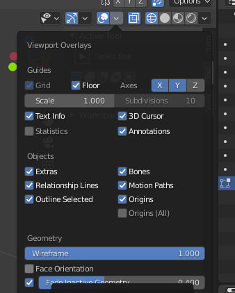

# Горячие клавиши "Blender"
## Основные сочетания:
1. ***Tab*** - переключение между режимом редактирования и объектным режимом.
2. Режим пропорционального редактирования. кружок вверху, перейти в режим редактирования куба, потянуть вершину, она будет тянуть за собой другие вершины в зависимости от разрешения круга, которое редактируется колесиком.

3. ***Shift + A*** - создание новой геометрии.

4. ***Shift + S*** - Режимы работы с 3d курсором. ***Shift + ПКМ*** - переместить 3D курсор в новое положение во въюпорте. 

5. ***G*** - команда move(->XYZ - выбор одной из осей по которой двигать) -> ctrl дискретное перемещение по клеткам.  
    5.1. ***G ->(XX || YY || ZZ)*** - двойной выбор оси  позволяет двигать объект вдоль локальной оси если объект повернут или перемещен относительно глобальных координат.  
    5.2. ***G -> (Shift + (XYZ))*** - объект будет перемещаться по всем осям за исключением выбранной через Shift.  
    5.3. ***G -> Shift + (XX || YY || ZZ)*** - Тоже самое только касательно локальной системы координат.  
6. ***R*** - команда поворота (->XYZ - выбор одной из осей по которой поворачивать)  -> ctrl дискретное приращение градусов.  
    6.1. ***R -> (XX || YY || ZZ)*** - двойной выбор оси  позволяет вращать объект вдоль локальной оси если объект повернут или перемещен относительно глобальных координат.  
    6.2. ***R -> (Shift + (XYZ))*** - объект будет вертелься по всем осям за исключением выбранной через Shift.  
    6.3. ***R -> Shift + (XX || YY || ZZ)*** - Тоже самое только касательно локальной системы координат.
7. ***S*** - масштаб(->XYZ - выбор одной из осей по которой масштабировать) -> ctrl дискретное изменение масштаба по сетке.  
    7.1. ***S -> (XX || YY || ZZ)*** - двойной выбор оси  позволяет масштабировать объект вдоль локальной оси если объект повернут или перемещен относительно глобальных координат.  
    7.2. ***S -> (Shift + (XYZ))*** - объект будет масштабироваться по всем осям за исключением выбранной через Shift.  
    7.3. ***S -> Shift + (XX || YY || ZZ)*** - Тоже самое только касательно локальной системы координат.  
    7.4. ***Ctrl + A*** - подтвердить масштаб чтобы по всем осям был 1, иначе инмтрументы редактирования и модификаторы будут применяться не корректно(такие как ***Bevel***).

8. ПКМ на выделенном объекте(в том числе вершина, грань, ребро) в режиме -> Set origin - режимы работы с ориджином.

9. в режиме редактирования клавиши 1,2,3 - выбор редактирования вершины, ребра, грани.

10. Включить сглаживание объекта - пкм на выделенном объекте пункт shade smooth. Настрйока данных выделенного объекта(зеленый треугольник с тремя квадратиками в вершинах) ->Normals->autosmooth задать угол грани при котором будет видно сглаживание.

11. ***Shift + D*** - копирование выделенного объекта. Потом можно G->(XYZ) для перемещения его вдоль одной из осей.  

    11.1. ***Alt + D*** - создание дубликата объекта.

12. ***X*** - удалить выбранный объект. В режиме редактирования геометрии расширяется до схлопывания геометрии по вершинам ребрам граням.

13. ***M*** - добавить выделенные объекты в коллекцию, которая была предварительно создана.

14. ***/*** - на нумпаде, оставляет во вюьпорте только выделенный объект, остальные делает невидимыми для удобства редактирования.

15. ***Ctrl + J*** - не плюс нажимается одновременно, объеденить выделенные объекты в одну mesh. Иначе выеделить все объекты, а затем object->join, если вдруг горячие клавиши не работают.

16. ***Alt + Z*** - режим рентгеновских лучей.  
17. ***H*** - Спрятать выделенные объекты в текущей сцене.
    17.1. ***Shift + H*** - прячутся все объекты, кроме тех, которые выделены.  
    17.2. ***Alt + H*** - восстановить видимость всех спрятанных в сцене ообъектов. 
18. ***Z*** - открывает меню выбора режима отображения модели ***Wirefram***, ***Solid*** и т.д.
 

## Режим редактирования:
1. ***Ctrl + B*** - Bevel - создание фасок для граней. ***Shift + Ctrl + B*** - аналогично для вершин.
2. ***I*** - inset, создание грани внутри грани.   
    2.1  ***II*** - если выделено две грани и нужно работать с каждой по отдельности.  
    2.2  ***I + B*** - если объект не имеет смежной грани рядом с выделенной, например при работе c модификатором mirror, то inset производится относительно ребер у которых есть смежные грани, потому что Bevel не делается для ребер, у которых нет смежных граней.
3. ***E*** - extrude - выдавить грань или нескольк граней.   
    3.1. ***Alt + E*** - дополнительные опции экструда, например extrude along normals, экструдирует каждую грань в по направлению нормалей, очень удобно для создания книг.
4. ***Ctrl + R*** - режим петли из ребер. ЛКМ - выбрать одну(или несколько колесиком) -> ПКМ после ЛКМ петля создастя по середине. ->ЛКМ - петля создастся в той половине где указано.(зажатая ctrl - дискретное перемещение петли по клеткам).  
    4.1. ***(Ctrl + R) -> (Ctrl + B)***  - каждая петля раздваиватеся симметрично в соответствии с поеведением bevel. Удобно для создания симметричных замнкутых углублений или фасок в модели.

5. ***K*** - Режим нож. ЛКМ - от одной координаты, ЛКМ - к другой координате(не заходя за грани) прорежет ребра на одной грани.  ***Enter*** - подтвердить и закончить.   
    5.1. ***Ctrl + K*** - будет резать от середины одного ребра к середине следующего, т.е. ортогонально если их длины равны.  
    5.2 ***K->Z*** - прорежет ребря как и петля насквозь всю модель в направлении вьюпорта.   
    5.3. ***K->C*** - Если нужно резать под дискретными углами ->C нажимаем один раз будут углы 0-45-90 градусов.  

6. ***F*** - соединить два выбранных пустых ребра, которые лежат друг на против друга, и не соединены граню. Заполняет гранью. Так же соединяет 2 выделенных вершины между которыми нет ребра. Если вершины или ребра образуют замкнутый контур - то закроет их гранью.

7. ***P*** - отделить от геометрии выделенные грани как отдельную геометрию. Хорошо использовать после ***Shift + D*** на этих гранях. Так как они отделяются как отдельная геометрия не нарушая существующей. Естественно надо нажать esc после ***Shift + D***.

8. ***V*** - разрезать форму по выделенным ребрам.

    8.1. ***M*** - объеденить форму разрезанную через V. пункт By Distance можно оставить 0.0001  
    8.1.1. ***M*** - если выделить несколько вершин и нажать ***M*** то они будут объединены(merged) в одну по первой, по последней, по центру или курсору. Для использования auto-merge(правый верхний угол в режиме редактирования) необходимо выделить вершину и перемещать ее к ближайшей, с которой хотим смерджить после двойного нажатия на ***G***.

    8.2. ***Y*** - отделить выбранные грани в рамках одной геометрии от этой геометрии как отдельные меши, но только они остаются внутри геометрии и их можно двигать. Потом можно mesh->cleanup->fill holes и создастся как бы вмятина-стык, между отделенными геометриями если отделенная часть не двигалась.

9. ***2xG*** - смещать ребро по направляющим ребрам, которые под углом к ним. если зажать alt то можно выдвигать ребро за пределы боундинг бокса геометрии.

10. ***L*** - выделить все грани меша в режиме редактиврования, который ранее был объединен коммандой join: object->join(ctrl J). Затем его можно отделить коммандой P

11. ***U*** - вызывает UV mapping menu для unvrap'a.

12. ***Shift + H*** позволяет спрятать всю геометрию кроме выделенной и редактировать ее отдельно, например инструментом пропорционального редактирования, а потом восстановить видимость ***Alt + H*** и будет видно, что остальная геометрия не подверглась редактированию.  
      12.1. ***Alt + H*** - восстановить видимость спрятанной геометрии.

13. ***J*** - позволяет проложить между двумя выделенными точками ребро.

14. ***Alt + N*** - Открывает меню работы с нормалями при выделенных гранях. Например когда применяется модификатор ***Bevel*** но появляются артефакты можно выделить все нормальи и в полученном меню нажать ***Recalculate outside***.
    Отображение ориентации нормалей  включается галочкой ***Face Orientation*** в этом меню:  
    

## Материалы:
1. ***Ctrl + L*** - создать линк материалов между выделенными объектами. На один должен быть назначен материал, заранее созданный. Выделять вначале нужно объекты, на которых нет материала, последним на котором он есть а затем ***Ctrl + L*** -> Materials.

2. В окне Shading ***Ctrl + Shift + T*** - импорт картинок текстур.